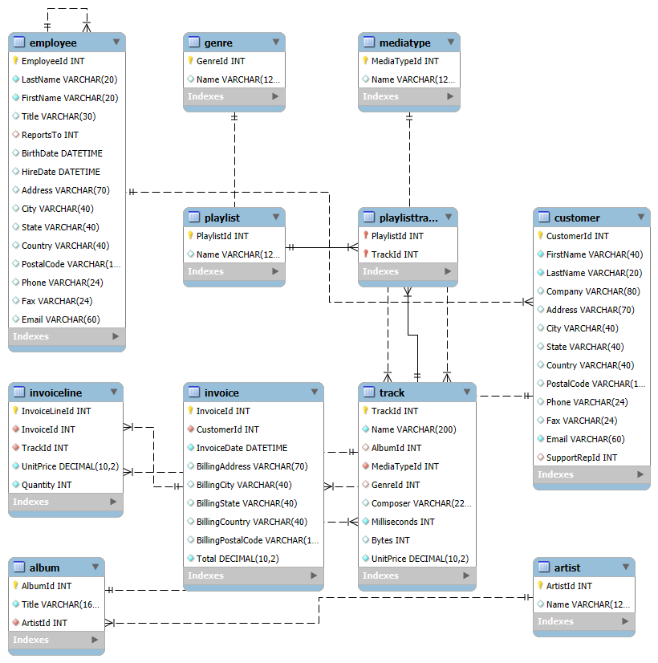

## Schema (ERD)

# Chinook-mysql-queries
MySQL Workbench queries on the Chinook sample database (joins, window functions, LTV view, ERD)
# Chinook SQL — Practice Prompts (MySQL Workbench)

Below are the query prompts I use to practice joins, grouping, and window functions on the **Chinook** sample database. Each item is a small, interview-style task.

## Query Tasks
1) Return customers **outside the United States**, showing only full name, `CustomerId`, and `Country`.
2) List **only** the customers whose `Country` is **Brazil**.
3) For **Brazilian customers**, list their **invoices** with: customer full name, `InvoiceId`, `InvoiceDate`, and `BillingCountry`.
4) Show **employees who are sales agents** (only those in the sales-agent role).
5) From `Invoice`, produce a **distinct list of billing countries**.
6) Display **all invoices** that belong to customers **from Brazil**.
7) For **each sales agent**, list the **invoices** they handled; include the agent’s **full name**.
8) For **all invoices**, show: **Invoice Total**, **Customer name**, **Customer country**, and the **Sales Agent** name.
9) Count how many **invoices** occurred in **2009** and **2011**, and report the **total sales** for each of those years.
10) In `InvoiceLine`, **count** the number of line items for **InvoiceId = 37**.
11) In `InvoiceLine`, **count line items per invoice** (hint: use **GROUP BY** `InvoiceId`).
12) Join so that **each invoice line** includes its **track name**.
13) Join so that **each invoice line** includes the **track name** **and** the **artist name**.
14) Show the **number of invoices per country** (hint: **GROUP BY** the country field).
15) Show the **total tracks in each playlist**, including the **playlist name** in the result.
16) List **all tracks**, but **do not show any ID columns**; include the **album title**, **media type**, and **genre**.
17) List **all invoices** and add a column with the **count of invoice line items** for each.
18) Summarize **total sales per sales agent**.
19) Identify the **sales agent with the highest sales in 2009**.
20) Identify the **sales agent with the highest sales in 2010**.
21) Identify the **top-grossing sales agent overall** (across all years).
22) Show how many **customers are assigned to each sales agent**.
23) Compute **total sales by country** and indicate **which country spent the most**.
24) Find the **most-purchased track** in **2013**.
25) List the **top 5 most-purchased tracks** overall.
26) Return the **top 3 best-selling artists**.
27) Determine the **most-purchased media type**.
